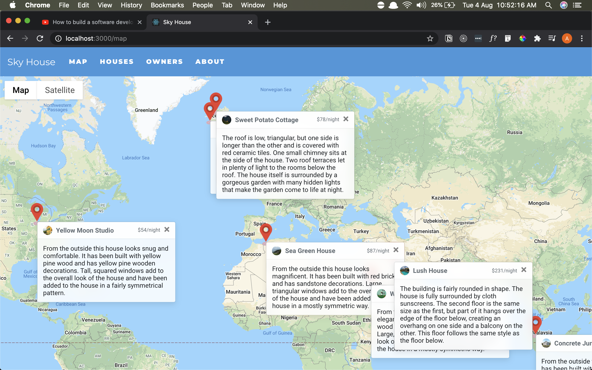
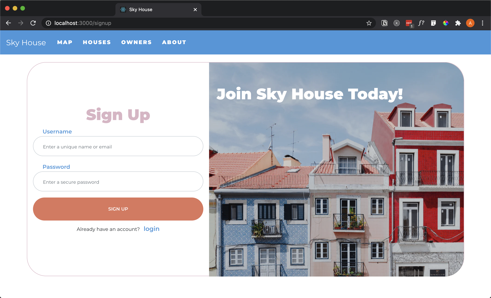
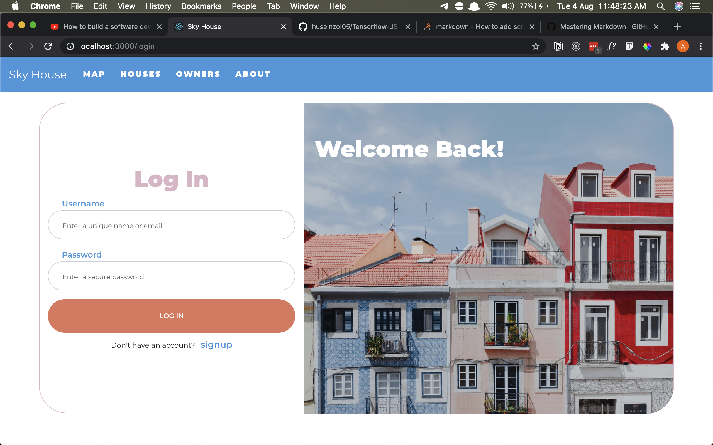
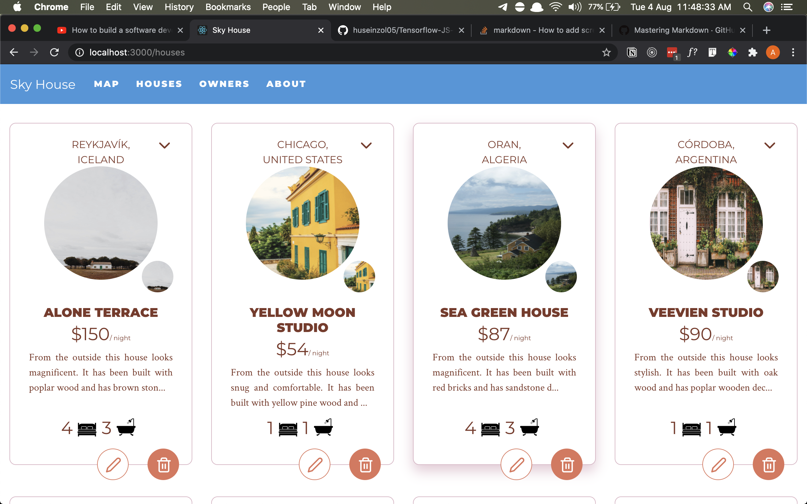

# Sky House Project

MERN stack project using MongoDB, Express JS, React JS and Node JS.
Also using public APIs:

- Unsplash API
- Google Map API

_unfinished project_

# How to run

`npm run dev`
Open [http://localhost:3000](http://localhost:3000) to view it in the browser.

# UI Output

